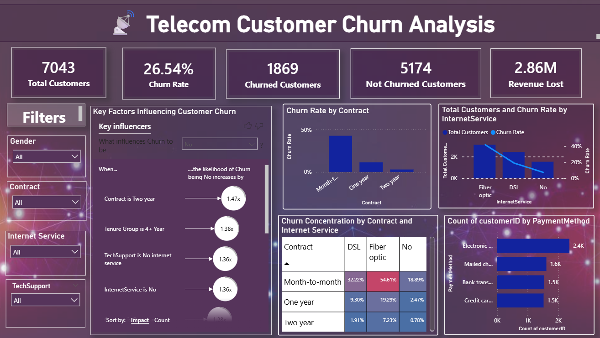

# 🔗 TELECOM CUSTOMER CHURN ANALYSIS  

This project presents a comprehensive customer churn analysis for a telecom company. The analysis focuses on understanding customer behavior, identifying churn drivers, and quantifying revenue impact to support data-driven retention strategies.

The analysis was carried out using **Power BI**, and the final deliverables are structured into thematic reports and a consolidated dashboard.

---

## 📊 Power BI Dashboard  

All reports and the final dashboard are available in the **Dashboard** folder.

The following Power BI reports have been created:

---

### 1️⃣ Churn Overview Analysis  

- Total Customers  
- Overall Churn Rate  
- Total Churned Customers  
- Total Retained Customers  
- Revenue Lost  
- Revenue Retained  
- Revenue at Risk  

🔍 **Churn Impact Summary**

---

### 2️⃣ Contract & Tenure Analysis  

- Churn Rate by Contract Type  
- Churn Risk by Tenure Group  
- Churn Concentration by Contract and Internet Service  
- High-Risk Segment Identification  
- Average Tenure by Contract  

🔍 **High-Risk Contract Segmentation**

---

### 3️⃣ Service Subscription Analysis  

- Churn Rate by Internet Service  
- Churn Rate by Total Services  
- Add-on Services Common Among Churned Customers  
- Service Combination Impact on Churn  
- Phone Service Distribution  

🔍 **Service-Level Churn Drivers**

---

### 4️⃣ Billing & Payment Analysis  

- Churn Rate by Payment Method  
- Churn Rate by Paperless Billing  
- Average Monthly Charges by Payment Method  
- Average Total Charges by Contract  

🔍 **Billing Behavior Impact on Churn**

---

### 5️⃣ Customer Demographics Analysis  

- Churn Rate by Gender  
- Churn Rate by Senior Citizen Type  
- Churn Rate by Tenure Group  
- Customers at Risk Segmentation  

🔍 **Demographic Risk Distribution**

---

### 6️⃣ Final Consolidated Report  

This report brings together the most important and insightful visualizations from all the above analyses to present a high-level summary of churn trends, revenue impact, and high-risk customer segments.

## 📊 Dashboard Preview  

---

## 🔗 Access Interactive Dashboard  

🔗 **Power BI Dashboard:**  
https://app.powerbi.com/links/8YcnNn8ej7?ctid=21810484-8989-4720-9094-279c7ca6de05&pbi_source=linkShare 

---

## 📁 Dataset  

The dataset used in this project is stored in the **Data** folder.

It contains:

- 7,043 customer records  
- 21 columns  
- Customer demographics  
- Service details  
- Contract information  
- Billing and payment methods  
- Target variable: Churn (Yes/No)

---

## 📌 About the Project  

This project aims to:

- Explore and visualize customer churn patterns  
- Identify high-risk customer segments  
- Analyze financial impact of churn  
- Detect key churn drivers  
- Support proactive retention strategies  
- Deliver insights through an interactive and easy-to-understand Power BI dashboard  

---

## 🔗 Connect with Me  

💼 **Sakshi Patil**  
🔗 https://www.linkedin.com/in/sakshi-patil-482245251  

For any questions, suggestions, or collaboration opportunities, feel free to connect or open an issue.
